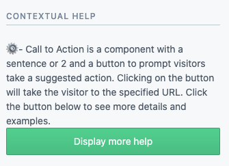
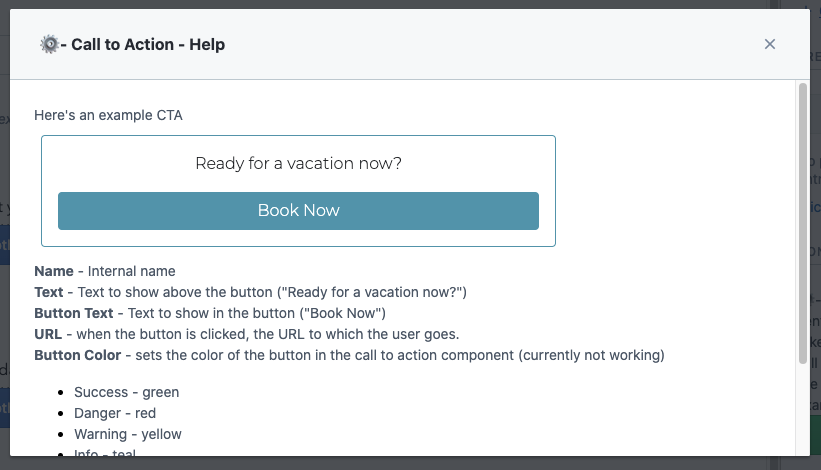

# Contextual Reference
UI Extension for showing help for the current content type that's being edited.

## Installation

* Set up your extension in your space:

```bash
npm install
contentful login
npm run configure
npm run start
```

* Run the migration to set up ypur Contextual Help content type:

```bash
contentful space migration migrations/createInternalContextualHelp.js
```

* Add the extension to the sidebar of each content type you want contextual help for.
* Create an Internal Contextual Help for each of the Content Types you're interested in adding additional help for.
* The sidebar widget will now display the Content Type description, and will load the additional help on a dialog when you press the button.

## Screenshots

The Contextual Help UI Extension shows up as a sidebar widget and shows the description as set for the Content Type and a button for more help.



When the more help button is clicked, a modal appears on top of the editor interface showing the rendered rich text field of the Internal Contextual Help entry for the current content type.


